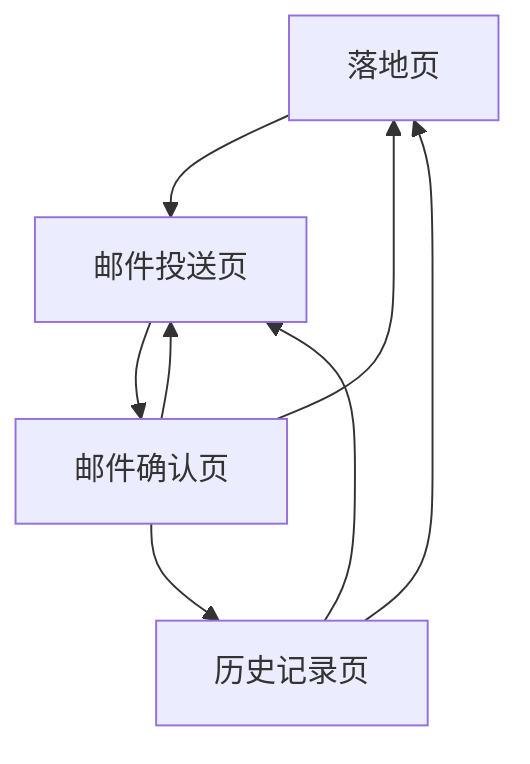

## 1. 产品概述
时光邮局是一个让用户给未来的自己写信的web应用。用户可以在页面留下想对自己说的话，设置未来的收信时间，系统会在指定时间自动发送邮件给用户。

这是一个帮助用户记录当下想法、与未来的自己对话的情感类工具，适合所有希望保存回忆、设定目标或进行自我反思的用户使用。

## 2. 核心功能

### 2.1 用户角色
| 角色 | 注册方式 | 核心权限 |
|------|----------|----------|
| 普通用户 | 无需注册，直接填写邮箱即可 | 可以创建时光邮件、查看邮件状态 |

### 2.2 功能模块
时光邮局应用包含以下主要页面：
1. **落地页**：介绍时光邮局的功能特点，引导用户开始使用
2. **邮件投送页**：用户填写邮件内容、设置收信时间和邮箱地址
3. **邮件确认页**：显示邮件创建成功的确认信息
4. **历史记录页**：用户查看自己寄出的所有历史信件

### 2.3 页面详情
| 页面名称 | 模块名称 | 功能描述 |
|-----------|-------------|-------------|
| 落地页 | 英雄区域 | 展示时光邮局的核心概念和情感价值，包含醒目的标题和副标题 |
| 落地页 | 功能介绍 | 通过图文结合的方式介绍时光邮局的三个核心功能：写信、定时、收信 |
| 落地页 | 使用引导 | 提供清晰的行动指引，引导用户点击开始写信 |
| 邮件投送页 | 邮件编辑器 | 提供简洁的文本编辑区域，支持多行文本输入，可输入想对自己说的话 |
| 邮件投送页 | 时间设置器 | 提供日期和时间选择器，让用户设置未来收信的具体时间 |
| 邮件投送页 | 邮箱输入 | 输入接收邮件的邮箱地址，支持邮箱格式验证 |
| 邮件投送页 | 提交按钮 | 确认提交邮件，系统保存邮件信息并安排定时发送 |
| 邮件确认页 | 成功提示 | 显示邮件已成功创建，告知用户将在指定时间收到邮件 |
| 邮件确认页 | 邮件预览 | 显示刚刚创建的邮件内容摘要，包含收信时间和邮箱地址 |
| 邮件确认页 | 继续操作 | 提供返回首页、查看历史记录或创建新邮件的选项 |
| 历史记录页 | 信件列表 | 显示用户所有寄出的历史信件，包含标题、送出时间、送达状态 |
| 历史记录页 | 状态筛选 | 提供按状态筛选功能（全部/待发送/已发送/发送失败） |
| 历史记录页 | 隐私保护 | 只显示信件标题，不显示正文内容保护用户隐私 |
| 历史记录页 | 返回导航 | 提供返回首页或创建新邮件的快速入口 |

## 3. 核心流程
用户操作流程如下：

1. 用户访问落地页，了解时光邮局的功能
2. 点击开始写信，进入邮件投送页
3. 在邮件编辑器中输入想对自己说的话
4. 设置未来收信的时间和日期
5. 输入接收邮件的邮箱地址
6. 点击提交按钮创建邮件
7. 系统显示确认页面，邮件将在指定时间自动发送

## 4. 用户界面设计

### 4.1 设计风格
- **主色调**：温暖的琥珀色（#FFA500）和深蓝色（#2C3E50）
- **按钮样式**：圆角矩形，悬停时有轻微阴影效果
- **字体**：主标题使用思源黑体，正文使用系统默认字体
- **布局风格**：卡片式布局，居中显示，留白充足
- **图标风格**：使用线性图标，简洁现代

### 4.2 页面设计概述
| 页面名称 | 模块名称 | UI元素 |
|-----------|-------------|-------------|
| 落地页 | 英雄区域 | 大标题使用36px加粗字体，副标题18px常规字体，背景使用渐变色从浅橙到深橙 |
| 落地页 | 功能介绍 | 三列卡片布局，每张卡片包含图标、标题和简短描述，卡片有轻微阴影 |
| 邮件投送页 | 邮件编辑器 | 文本域高度200px，边框2px圆角8px，获得焦点时边框变色 |
| 邮件投送页 | 时间设置器 | 使用原生日期时间选择器，样式与整体设计风格保持一致 |
| 邮件投送页 | 邮箱输入 | 输入框高度40px，左侧有邮箱图标，实时验证邮箱格式 |
| 邮件确认页 | 成功提示 | 使用绿色成功图标，大字体显示"邮件已创建"，下方显示详细信息 |

### 4.3 响应式设计
- 采用桌面端优先设计，默认适配1920px宽度
- 平板端（768px-1024px）采用单列布局，调整字体大小和间距
- 移动端（小于768px）所有元素垂直堆叠，按钮宽度100%
- 支持触摸交互优化，按钮点击区域不小于44px