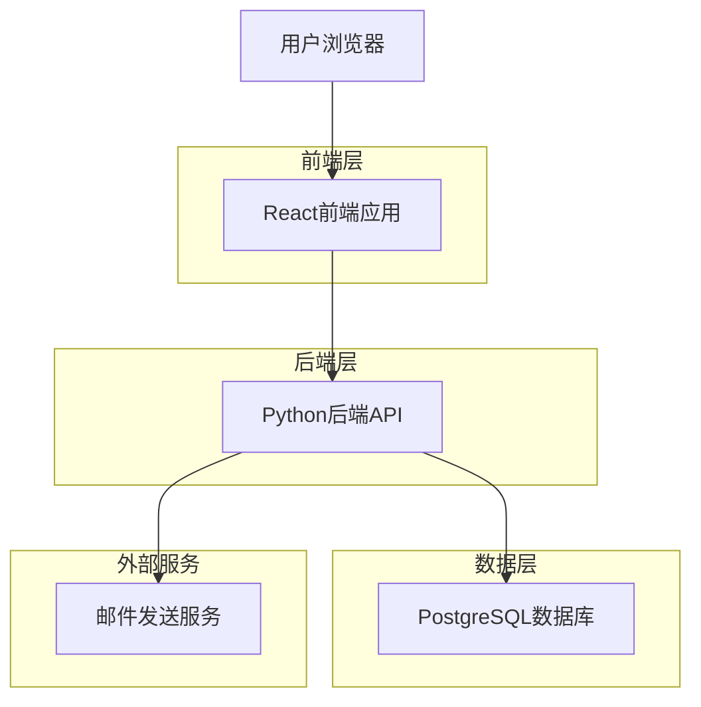
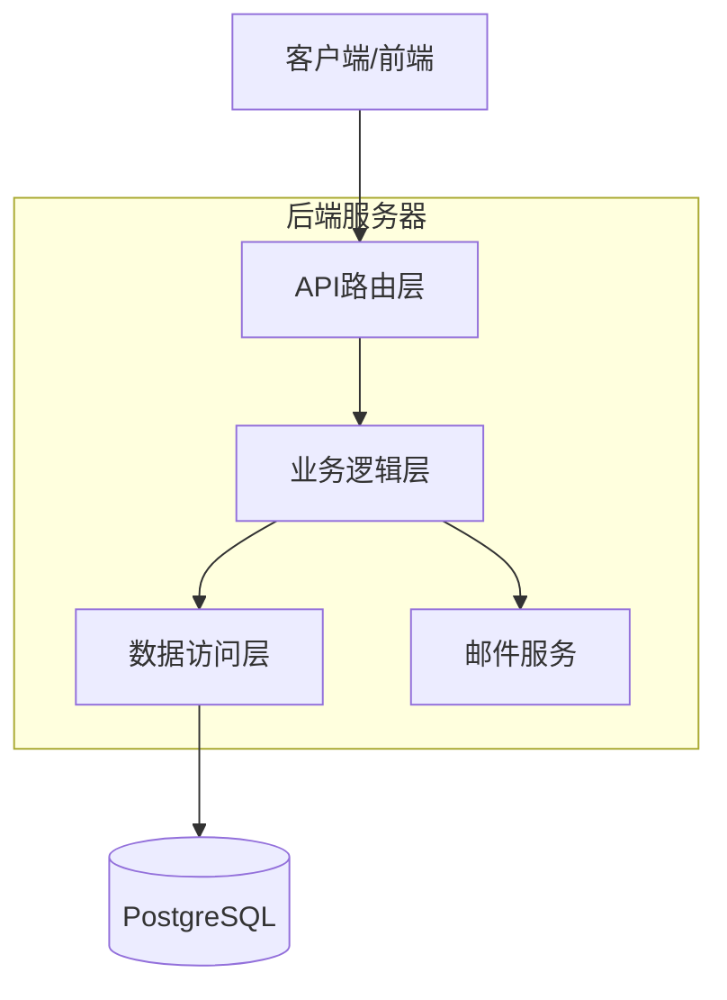
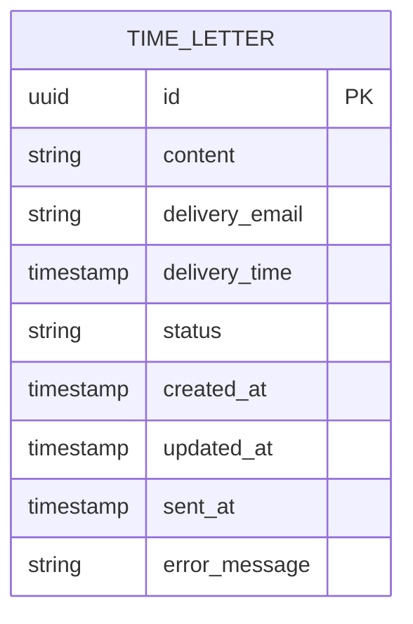

## 1. 架构设计



## 2. 技术描述

- **前端**: React@18 + tailwindcss@3 + vite
- **初始化工具**: vite-init
- **后端**: Python 3.12 + FastAPI
- **数据库**: PostgreSQL 15
- **邮件服务**: SMTP (Python内置smtplib)

## 3. 路由定义

| 路由 | 用途 |
|------|------|
| / | 落地页，展示时光邮局功能介绍 |
| /compose | 邮件投送页，用户创建时光邮件 |
| /confirm | 邮件确认页，显示创建成功信息 |
| /history | 历史记录页，用户查看寄出的历史信件 |

## 4. API定义

### 4.1 核心API

**创建时光邮件**
```
POST /api/time-letters
```

请求参数：
| 参数名 | 参数类型 | 是否必需 | 描述 |
|-----------|-------------|-------------|-------------|
| content | string | true | 邮件内容，用户想对自己说的话 |
| delivery_email | string | true | 接收邮件的邮箱地址 |
| delivery_time | datetime | true | 邮件发送时间，必须大于当前时间 |

响应参数：
| 参数名 | 参数类型 | 描述 |
|-----------|-------------|-------------|
| letter_id | string | 邮件唯一标识符 |
| status | string | 邮件状态 ("scheduled") |
| created_at | datetime | 邮件创建时间 |

请求示例：
```json
{
  "content": "亲爱的未来的我，希望你还记得今天的心情...",
  "delivery_email": "user@example.com",
  "delivery_time": "2024-12-31T10:00:00Z"
}
```

响应示例：
```json
{
  "letter_id": "550e8400-e29b-41d4-a716-446655440000",
  "status": "scheduled",
  "created_at": "2024-01-15T14:30:00Z"
}
```

**查询历史信件列表**
```
GET /api/time-letters/history?email={user_email}
```

请求参数：
| 参数名 | 参数类型 | 是否必需 | 描述 |
|-----------|-------------|-------------|-------------|
| email | string | 是 | 用户邮箱地址 |

响应参数：
| 参数名 | 参数类型 | 描述 |
|-----------|-------------|-------------|
| letters | array | 历史信件列表 |
| letters[].id | string | 信件唯一标识符 |
| letters[].title | string | 信件标题（内容摘要） |
| letters[].delivery_time | datetime | 计划发送时间 |
| letters[].status | string | 信件状态 (scheduled/sent/failed) |
| letters[].created_at | datetime | 信件创建时间 |

响应示例：
```json
{
  "letters": [
    {
      "id": "550e8400-e29b-41d4-a716-446655440000",
      "title": "亲爱的未来的我，希望你还记得今天的心情...",
      "delivery_time": "2024-12-31T10:00:00Z",
      "status": "scheduled",
      "created_at": "2024-01-15T14:30:00Z"
    }
  ]
}
```

## 5. 服务器架构图



## 6. 数据模型

### 6.1 数据模型定义



### 6.2 数据定义语言

**时光邮件表 (time_letters)**
```sql
-- 创建表
CREATE TABLE time_letters (
    id UUID PRIMARY KEY DEFAULT gen_random_uuid(),
    content TEXT NOT NULL,
    delivery_email VARCHAR(255) NOT NULL,
    delivery_time TIMESTAMP WITH TIME ZONE NOT NULL,
    status VARCHAR(20) DEFAULT 'scheduled' CHECK (status IN ('scheduled', 'sent', 'failed')),
    sent_at TIMESTAMP WITH TIME ZONE,
    error_message TEXT,
    created_at TIMESTAMP WITH TIME ZONE DEFAULT NOW(),
    updated_at TIMESTAMP WITH TIME ZONE DEFAULT NOW()
);

-- 创建索引
CREATE INDEX idx_time_letters_delivery_time ON time_letters(delivery_time);
CREATE INDEX idx_time_letters_status ON time_letters(status);
CREATE INDEX idx_time_letters_delivery_email ON time_letters(delivery_email);
CREATE INDEX idx_time_letters_email_status ON time_letters(delivery_email, status);
CREATE INDEX idx_time_letters_created_at ON time_letters(created_at DESC);

-- 初始数据（可选）
-- INSERT INTO time_letters (content, delivery_email, delivery_time) 
-- VALUES ('测试邮件内容', 'test@example.com', '2024-12-31 10:00:00+00');
```

## 7. 定时任务设计

系统需要一个后台任务来定期检查并发送到期的邮件：

```python
# 伪代码示例
def send_due_letters():
    # 查询所有到期的待发送邮件
    due_letters = db.query(
        "SELECT * FROM time_letters 
         WHERE delivery_time <= NOW() 
         AND status = 'scheduled'"
    )
    
    for letter in due_letters:
        try:
            # 发送邮件
            send_email(
                to=letter.delivery_email,
                subject="来自过去的你的信",
                content=letter.content
            )
            # 更新状态
            db.update(letter.id, status="sent")
        except Exception as e:
            # 发送失败，更新状态
            db.update(letter.id, status="failed")
            log_error(e)
```

这个任务可以通过以下方式实现：
1. Python的APScheduler库进行定时调度
2. 系统cron job定期调用API
3. 使用Python的asyncio进行异步处理